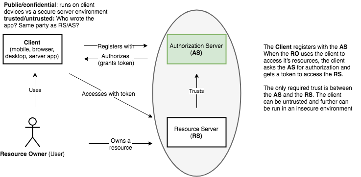

# PoC Design

RFC Protocols are already established, and call for a synchronous HTTP REST req/resp data plane.
The control plane (for administrative configuration of clients, ) allows for a more interesting asynchronous event sourced design options.

## System View

The diagram below depicts the major actors in the OIDC ecosystem.

It is within the purview of this effort to design and implement the Authorization Server (shaded in green), and support the use of externally written clients. Time permitting, an admin app will be written to allow for customer administration of their clients.

## Technology Choices

Node 8.x was selected as the reference implementation framework of choice due to the following considerations : 
* The I/O bound nature of expected workloads
* Agility - Rapid iteration made possible with "schemaless" NoSQL Stores (MongoDB document and Redis key/value stores)
* Extensibility - JS/Node is an attractive choice for allowing platform extensibility to cusomers in the future (hooks into specific events and the authorization pipeline)

## Container View

Bounded contexts

## Scope of Reference Implementation

(INSERT SHADED PIC OF CONTAINER DESIGN)

* SOLID design
* Externalized Configuration (TODO add bricks/mortar principles)

This section details the scope of work to be done on the architectural design and the reference implementation. The distinction here is that the design will incorporate additional features and deployment elements which are not implemented in the initial reference implementation, but should be completed prior to deployment to an IaaS provider.

Includes Users, time permitting a subset of admin, no CRM. Does not include distributed log for analytics events and asynchronous event sourcing (admin functions).

Though APM metrics may warrant separate services for the main `/authorize` and `/token` endpoints to allow their scale-out, they will initially be implemented in the API gateway code as separate express Router instances until concrete evidence supports their evolution.

## Future Directions

* Feature Flag support
* CI/CD (CircleCI, Jenkins)
* Distributed logging (Jaegar/OpenTracing)
* Test automation (Chimp)
* Anomaly Detection, account blocking
* API GW rate limiting
* Email messaging
* Authorization pipeline customization (Node.js)
* connections to SAML IdPs
* AWS Lambda / Google Cloud Functions / Azure Functions - (JS only ubiquitously supported language)* CRM/ticketing system

