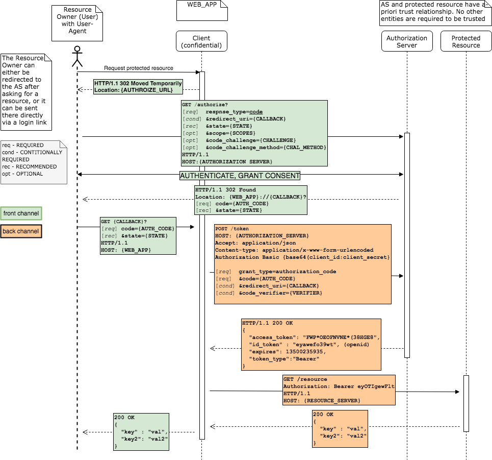
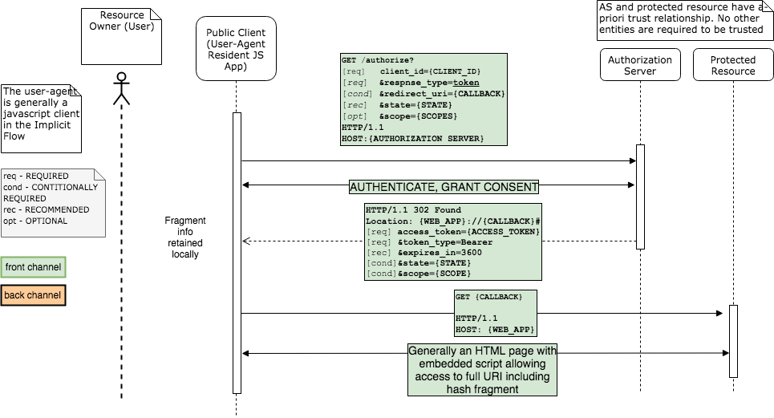
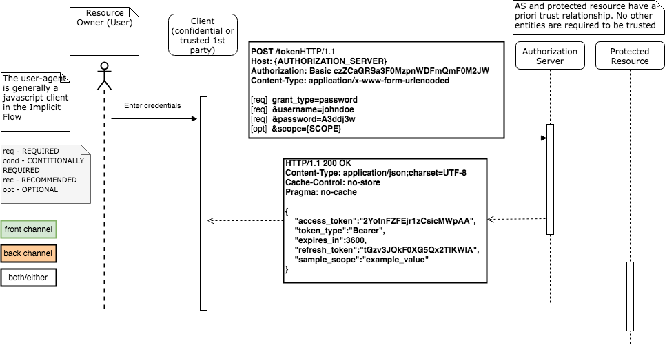
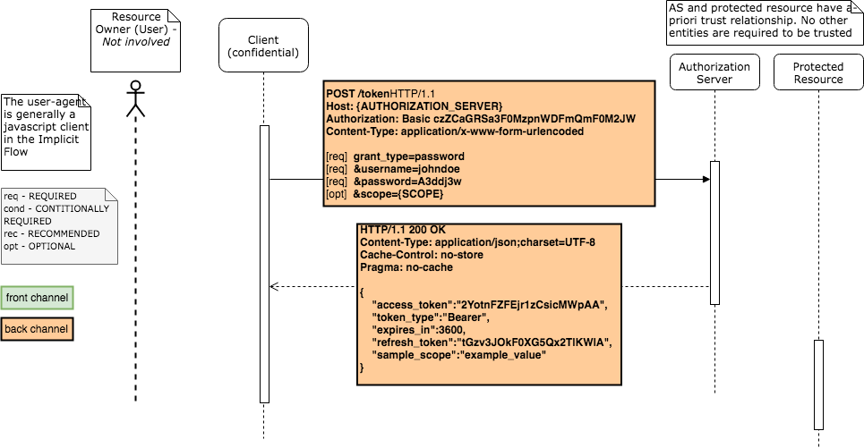
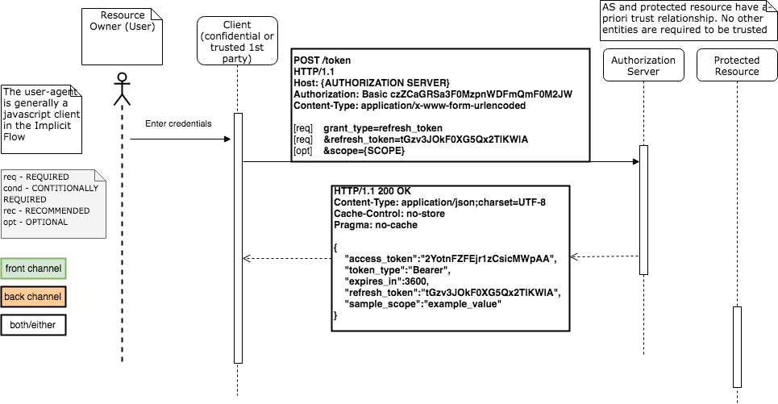
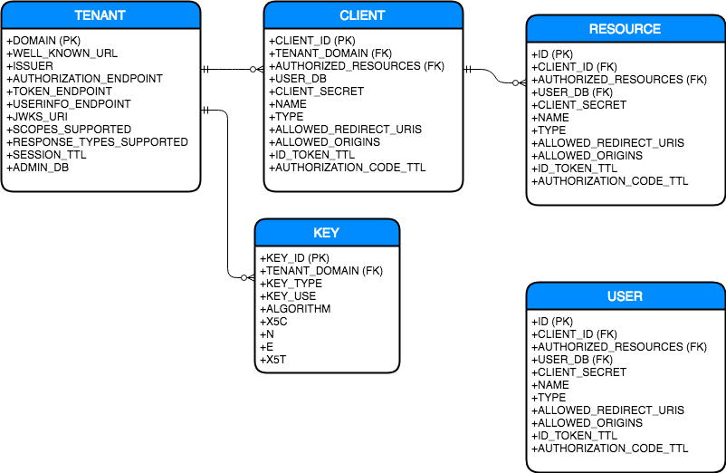

# OpenID Connect Domain Model

* [Overview](#Overview)
* [Flows](#Flows)
  - [Authorization Code](#Authorization-Code)
  - [Implicit](#Implicit)
  - [Password](#Password)
  - [Client Credentials](#Client-Credentials)
  - [Refresh](#Refresh)
  - [Hybrid](#Hybrid)
* [Data Models](#Data-Models)
  - [Logical Data Model (ERD)](#Logical-Data-Model)
  - [NoSQL Document Model](#NoSQL-Document-Model)

## Overview

This document details the overall OIDC domain, including
* OAuth2 and OIDC protocol flows. 
* Classic Relational (ERD) and NoSQL Data models 

For system design information, please see (./design.md).

## Flows

The diagrams below eludicate the OAuth2 and OpenID Connect protocol details.

**Front Channel** : Denotes communication between the end-user's User-Agent and the
Authorization Server. The User-Agent is typically a *public* (non-confidential)
entitiy like a web browser.

**Back Channel** : Denotes communication between a *confidential* client and
the Authorization Server. Back channel communications are not observable by a
public User-Agent.

The [Authorization Code](#Authorization-Code) and [Implicit](#Implicit) flows become
OpenID Connect flows when the `openid` scope is included in the `/authorization` request.
Hybrid Flows are created based on further modification of OpenID Authorization Code flows.
See the [Flow Type Table](#Flow-Type-Table) for details.

### Authorization Code

The canonical OAuth2 authorization flow, uses both front channel and back channel.
The initial request at the AS to the `/authorization` endpoint sets the
`response_type="code"`, the ensuing request for a token at the `/token` endpoint
sets `grant_type=authorization_code`).



**Figure**: Code Flow

See [Flow Type Table](#Flow-Type-Table) below for specific reponse_type / grant_type 
combinations and codes/tokens delivered for each.

The AS must:
- `/authorize` endpoint:
  * Check **client_id** at the `/authorize` endpoint
  * Check allowed **scopes**
  * Check allowed **redirect_uris**
  * Authenticate the User (for PoC **user_id** / **password**) with a login/consent screen
  * Check user consent
  * Send redirect with new code (saving **code_ttl=now+code_exp** and **code_used=false**) and echo any state sent. (Note: code_exp is recommended to be under 10minutes)
- `/token` endpoint (UA redirected to the client then requests an access token at the AS):
  * Check Basic HTTP Auth header, authenticate the **client_id:client_secret**
  * Check the **code** and **code_ttl** and **code_used**
  * Check the **redirect_uri** for validity
  * Respond with an access_token (**expires_in** setting) / refresh_token 

### Implicit 

A front-channel only OAuth2/OIDC authorization flow (/token endpoint is unused), used by public (non-confidential)
clients such as user-agent resident Javascript applications (eg. React/Angular).
The initial request at the AS to the /authorization endpoint sets the
`response_type="token"`. OIDC flows (`scope="openid"`) add `response_type="id_token"|"token id_token"`.
The AS does not produce refresh_tokens.



**Figure**: Implicit Flow

See [Flow Type Table](#Flow-Type-Table) below for information regarding the tokens
delivered for specific reponse_types.

The AS must:
- `/authorize` endpoint:
  * Check **client_id** at the `/authorize` endpoint
  * Check allowed **scopes**
  * Check allowed **redirect_uris**
  * Authenticate the User (for PoC **user_id** / **password**) with a login/consent screen
  * Check user consent
  * Send redirect with access_token (**expires_in** setting) and/or id_token in the hash fragment.
(Note: At this point we can additionally set a cookie to manage sessions)

### Password

Also known as *Resource Owner Password Grant*, generally back channel
with a confidential client, but can be used front channel with highly trusted 1st party clients.
The initial request at the AS to the `/token` endpoint sets the
`grant_type="password"`. The AS may produce an optional refresh_token.

This grant type should never be used with a 3rd party application, as the
authorization_code grant was designed exactly for that use case. This flow
is an improvement over direct client access to resource owner login credentials.
If the client type is confidential, it must authenticate with the AS.



**Figure**: Password Flow

The AS must:
- `/token` endpoint:
  * Check Basic HTTP Auth header, authenticate the **client_id:client_secret**
  * Check for allowed **scopes**
  * Authenticate the user (**user_id** and **password**)
  * Send access_token (**expires_in** setting) / refresh_token response

Note: This endpoint grant_type must be rate limited against brute force attack.

### Client Credentials 

The Client Credentials flow is a back channel flow which interacts with the 
`/token` endpoint and sets `grant_type=client_credentials`. This flow is used
for machine to machine communication which does not happen on behalf of a 
resource owner. Generally used for cron and ETL types of jobs. refresh_tokens
should not be issued.



**Figure**: Client Credentials Flow

The AS must:
- `/token` endpoint:
  * Check Basic HTTP Auth header, authenticate the **client_id:client_secret**
  * Check for allowed **scopes**
  * Send access_token (**expires_in** setting) response

### Refresh

Flow used to obtain a new `access_token`/`refresh_token` pair by exchanging 
a previously obtained `refresh_token`. Uses the `/token` endpoint, and sets
`grant_type=refresh_token`.



**Figure**: Refresh Flow


### Hybrid

The Hybrid Flow is an OIDC (`scope: openid`) flow that hits both the `/authorize`
and `/token` endpoints, and is a modification
of the [Authorization Code Flow](#Authorization-Code) above. It uses
`grant_type="code id_token"|"code token"|"code id_token token"`.
See [Flow Type Table](#Flow-Type-Table) below for specific reponse_type / grant_type 
combinations and codes/tokens delivered for each.

## Flow Type Table

Implicit Flows - Return an `access_token` or `id_token` in the authentication reponse URL hash fragment, do not hit `/token` endpoint

Hybrid Flows - Return an `access_token` or `id_token` in the authentication reponse URL hash fragment, and additionally hit `/token` endpoint

|  response_type        |  scope | /authorize returns         | grant_type                  | /token  returns                     |
| ----------------------|--------|----------------------------|-----------------------------|-------------------------------------|
| "code"                |        | code                       | authorization_code          | access_token refresh_token          |
| "code"                | openid | code                       | authorization_code          | access_token refresh_token id_token |
| "code token"          |        | code access_token          | (Hybrid) authorization_code | access_token                        |
| "code token"          | openid | code access_token          | (Hybrid) authorization_code | access_token id_token               |
| "code id_token"       |        | code                       | (Hybrid) authorization_code | access_token refresh_token          |
| "code id_token"       | openid | code id_token              | (Hybrid) authorization_code | access_token refresh_token id_token |
| "code token id_token" |        | code access_token          | (Hybrid) authorization_code | access_token                        |
| "code token id_token" | openid | code access_token id_token | (Hybrid) authorization_code | access_token id_token               |
| "token"               |        | access_token               | (Implicit)                  |                                     |
| "id_token"            | openid | id_token                   | (Implicit)                  |                                     |
| "id_token token"      | openid | id_token access_token      | (Implicit)                  |                                     |
| "none"                | openid |                            |                             |                                     |
|                       |        |                            | password                    | access_token [refresh_token]        |
|                       |        |                            | client_credentials          | access_token                        |
|                       |        |                            | refresh_token               | access_token refresh_token          |

## Data Models

The models below represent a classic ERD model and NoSQL document model of static configuration data and runtime data in the system.
The NoSQL model will also be referred to as the **aggregate** model.

A physical ERD model isn't included here, due to a design decision to go with a document based model. 
A document based model makes sense in this system due to an **impedance mismatch** between the query/update affinity
in the system, the **cardinality** relationships, and the relative **volatility** (update frequency) of the entities.
There are also fields, like `scopes` and `allowed_redirect_uris` for example, which may contain arbitrarily long strings.
A document based model also makes sense given the desire for malleability and agility, and the fact that 
ALTER statements are generally considered _evil_.

The aggregate model embeds (denormalizes) key/value entities where appropriate to align with the query affinity,
cardinality (1:1 and 1:few), and volatility of that data. References are used where appropriate (1:many and many:many).

There will be cases where cardinality, volatility, and affinity conflict. This is precisely why a service layer
(generally aligned with affinity) abstracts the details of the data model from the API used to interact with the 
data. The underlying DB is therefore able to evolve and align with a model that makes sense.

 _"The database is a detail, not part of the architecture" -- R. Martin_

### Logical Data Model

An initial revision of a logical data model looks like the following:



**Figure**: Logical Relational Model

Note that this model can be further normalized, but I've stopped here since the impedance mismatch with our use case
is already apparent. Note also that entity metadata hasn't been included (such as `createdAt`, `updatedAt` 
and `version` for optimistic locking to prevent concurrent lost updates). 

### NoSQL Aggregate Model

The central entity used at runtime is the **Client**, representing an OIDC client application. The **Client** 
information, along with it's children (**Resource**) are retrieved during authorization and token flows
and used to authenticate the client, check on redirect_uris, authenticate the **User**, and authorize
use of a **Resource**. These entities each have a similar 1:few cardinality relationship, and data
reads access the parent **Client** item plus the children **Resource** data. They are very infrequently
written to, but are generally written to as a single configuration entity. Therefore, basic NoSQL
best practice is to denormalize these objects and embed the **Resource** entries as nested objects.
This will also result in better performance for a predominantly read-heavy data access pattern.

See the schemas in the code for specific concrete model information

```javascript
// TENANT
{
  _id:                      String,
  tenant_domain:            String, // PK
  well_known_url:           String,
  authorization_endpoint:   String,
  token_endpoint:           String,
  userinfo_endpoint:        String,
  jwks_uri:                 String,
  pub_keys: [
    {
      key_id:   String,
      kty:      String,
      use:      String,
      alg:      String,
      x5c:      String,
      n:        String,
      e:        String,
      x5t:      String
    }
  ],
  admin_db:                 String,
  updatedAt:                Date,
  version:                  Number
}

// Aggregate type - Client application and the Resources beloging to that client
{
  _id:                        String,
  client_id:                  String,
  tenant_domain:              String,  // REFERENCE
  issuer:                     String,
  scopes_supported:           String,
  response_types_supported:   String,
  session_ttl:                Number,
  signing_key:                String,  // PEM
  resources: [
    {
      authorized:         Boolean,

    },
  ],

}

// Represents a single request at either `/authorize` or `/token` endpoints
{
  _id: <request_id>
  client_id: <client_id>
  response_type: string,

}

```

Obvious care must be taken with the private signing keys