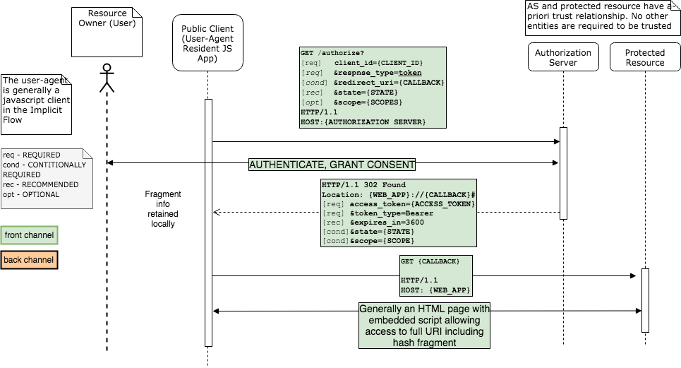

# OpenID Connect Domain Model

* [Overview](#Overview)
* [Flows](#Flows)
  - [Authorization Code](#Authorization-Code)
  - [Implicit](#Implicit)
  - [Password](#Password)
  - [Client Credentials](#Client-Credentials)
  - [Hybrid](#Hybrid)

## Overview

This document details the overall OIDC domain, including
* OAuth2 and OIDC protocol flows
* Classic Relational (ERD) and NoSQL Data models 

For system design information, please see (./design.md).

## Flows

### Authorization Code 

The canonical OAuth2 authorization flow, uses both front channel and back channel. 
The initial request at the AS to the /authorization endpoint sets the 
`response_type="code"`, the ensuing request for a token at the token endpoint 
set `grant_type=authorization_code`).

**Figure**: OAuth2 Code Flow

### Implicit 

A front-channel only OAuth2 authorization flow (/token endpoint is unused), used by public (non-confidential) 
clients such as user-agent resident Javascript applications (eg. React/Angular).
The initial request at the AS to the /authorization endpoint sets the 
`response_type="token"|"id_token"|"token id_token"`. The AS does not produce refresh_tokens. 

**Figure**: OAuth2 Implicit Flow

### Password

Generally back channel (/token) only, can be used with confidential and/or highly
trusted 1st party clients. 
The initial request at the AS to the /token endpoint sets the 
`grant_type="password"`. The AS may produce an optional refresh_token. 

### Client Credentials (grant_type=client_credentials, /authorize unused)

Back channel (/token) only

### Refresh (grant_type=refresh_token, /authorize unused)

Back channel (/token) only

### Hybrid (grant_type="code id_token", "code token", "code id_token token")

## response_type / grant_type table

Implicit Flows - Return an `access_token` or `id_token` in the authentication reponse URL hash fragment, do not hit `/token` endpoint
Hybrid Flows - Return an `access_token` or `id_token` in the authentication reponse URL hash fragment, additionally hit `/token` endpoint

|  response_type        |  scope | /authorize returns         | grant_type                  | /token  returns                     |
| ----------------------|--------|----------------------------|-----------------------------|-------------------------------------|
| "code"                |        | code                       | authorization_code          | access_token refresh_token          |
| "code"                | openid | code                       | authorization_code          | access_token refresh_token id_token |
| "code token"          |        | code access_token          | (Hybrid) authorization_code | access_token                        |
| "code token"          | openid | code access_token          | (Hybrid) authorization_code | access_token id_token               |
| "code id_token"       |        | code                       | (Hybrid) authorization_code | access_token refresh_token          |
| "code id_token"       | openid | code id_token              | (Hybrid) authorization_code | access_token refresh_token id_token |
| "code token id_token" |        | code access_token          | (Hybrid) authorization_code | access_token                        |
| "code token id_token" | openid | code access_token id_token | (Hybrid) authorization_code | access_token id_token               |
| "token"               |        | access_token               | (Implicit)                  |                                     |
| "id_token"            | openid | id_token                   | (Implicit)                  |                                     |
| "id_token token"      | openid | id_token access_token      | (Implicit)                  |                                     |
| "none"                | openid |                            |                             |                                     |
|                       |        |                            | password                    | access_token [refresh_token]        |
|                       |        |                            | client_credentials          | access_token                        |
|                       |        |                            | refresh_token               | access_token refresh_token          |

## Data Model

The models below represent a classic ERD model and NoSQL document model of static configuration data and runtime data in the system.

### Configuration Data ERD

### Configuration Data NoSQL Document Model

### Runtime Request Data ERD

### Runtime Request Data NoSQL Document Model
